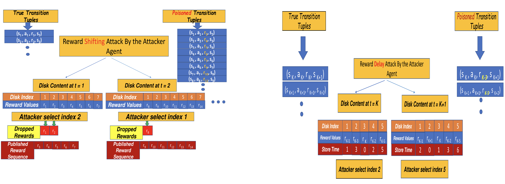

# Reward Delay Attacks on Deep Reinforcement Learning


This repository contains implementation of our work titled as _Reward Delay Attacks on Deep Reinforcement Learning_. We propose two different threat model for Reward Delay Attack ((a) Reward Shifting Attack; (b) Reward Delay Attack) on Deep Reinforcement Learning Framework.



**PDF**: https://arxiv.org/pdf/2209.03540v1.pdf

**Authors**: Anindya Sarkar, Jiarui Feng, Yevgeniy Vorobeychik, Christopher Gill, and Ning Zhang.

-------------------------------------------------------------------------------------
## Requirements
**Frameworks**: Our implementation uses **Python3.5** and **PyTorch-v1.4.0** framework.

**Packages**: You should install prerequisites using:
```shell
  pip install -r requirements.txt
```

## Reward Delay Attack

**Pong Environment**: Reward Delay Attack without the "wait action" option for the attacker is implemented in the following jupyter notebook file:

```shell
  Reward_Delay_Attack_pong_no_wait.ipynb
```

**Breakout Environment**: Reward Delay Attack without the "wait action" option for the attacker is implemented in the following jupyter notebook file:

```shell
  Reward_delay_Attack_Breakout_no_wait.ipynb
```

**Reward Delay Attack with the additional "wait action" option for the attacker is implemented in the following jupyter notebook file:**

**Pong Environment**: For the pong environment:

```shell
  Targeted_attack_pong-Delay_reward_BRB-wait.ipynb
```
**Breakout Environment**: FFor the Breakout Environment:

```shell
  DS_Targeted_attack_Breakout-BEFORE-REPLAY-BUFFER-FREE-DS10-wait.ipynb
```

For questions or comments, please send an e-mail to **anindyasarkar.ece@gmail.com** or use the issue tab in github.

You can cite our paper as:
```
@article{sarkar2022reward,
  title={Reward Delay Attacks on Deep Reinforcement Learning},
  author={Sarkar, Anindya and Feng, Jiarui and Vorobeychik, Yevgeniy and Gill, Christopher and Zhang, Ning},
  journal={arXiv preprint arXiv:2209.03540},
  year={2022}
}
```
